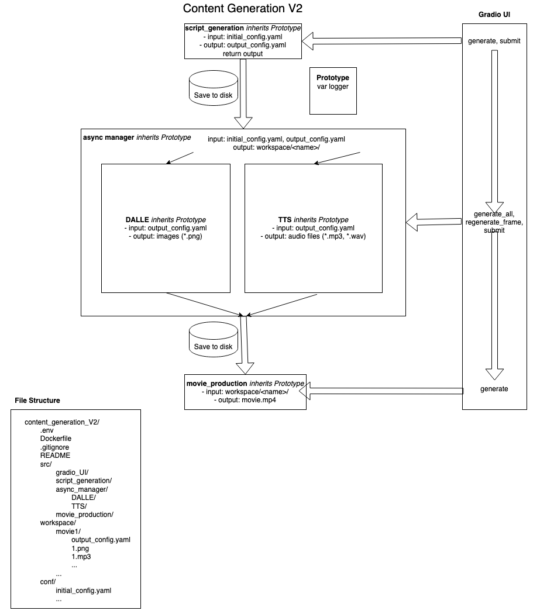

[](https://github.com/Helen-Group/content-generation-v2/actions/workflows/python-app.yml)

# Content Generation Version 2
This is the new and improved video generation pipeline, with better modularization, organization, scalability, and a UI.



## Set up
Setting up is now incredibly simple. Make sure that Docker is installed. Git clone this directory
```
git clone https://github.com/Helen-Group/content-generation_v2.git content-generation
```

Go into the directory, and build the relevant docker image.
```
cd content-generation-v2
docker build . -t content-generation
```

Run the relevant docker container. Use `-v .:/app` to mount current directory on the host machine (the content-generation directory) to the `/app` directory within the docker container.
```
docker run -d -v .:/app -it --name content-generation content-generation
```

_What does mounting do?_ It makes it so that the `/app` directory actually references the specified directory of the host machine. So changes on files inside  the container's `/app/` directory are actually changes on the host machine's specified directory (which is referenced by `.` in the `-v .:/app` in the command, which should be `content-generation/` if previous steps have been followed).

## Understanding things

You may enter the docker container's shell with the following:
```
docker exec -it content-generation bash
```

It is important to now explain the file structure of the `/app` directory we just exec'd into looks before proceeding with instructions. Here it is:
```
/app
    |
    |- /music_samples
    |
    |- /movie_workspace
    |
    |_ ... (other files and directories)
```
`/music_samples` - must be populated with `.mp3` files to use that will serve as background music for our videos
`/movie_workspace` – contains folders that will contain `.png` images and a `.yaml` files used to construct a video. Put more abstractly, each folder represents a video and contains the ingredients necessary to create a video. As you can imagine, this directory is critical to our vetting flow.

Let us look into the composition of `/apps/movie_workspace`'s sub-folders more deeply.

```
/app/movie_workspace
|
|--- /video_folder_1
|           | 
|           |--- x.png
|           |--- y.png
|           |--- z.png
|           |--- config.yaml
|
|
|--- /video_folder_2
|--- /video_folder_3
|...
```
`video_folder_1` has the images necessary to create a video. `config.yaml` indicates meta-data about each video, and contains the text for each image in this directory. In other words, `config.yaml` determines the structure, wording, and music for each video. Here is an example of a valid `config.yaml`.
`config.yaml`
```
title: Daniel in the Lion's Den
music_sample: on_the_edge.mp3
model_voice: en_US-lessac-medium
# speaker_number: 3 # Leave out speaker_number for single-model voices: https://rhasspy.github.io/piper-samples/
scenes: 
  - filepath: 1.png
    prompt: Renaissance art of Daniel in ancient Babylon, his wisdom radiating, admired by many, perfect for vertical 1024x1792 mobile screens, bright and spiritual ambiance.
    sentence: In ancient Babylon, Daniel was renowned for his wisdom and integrity.
    transformation_type: pan_right_to_left
  - filepath: 2.png
    prompt: Oil painting of King Darius favoring Daniel, a scene in the royal court of Babylon, vibrant colors, detailed for 1024x1792 mobile display.
    sentence: His excellence caught the eye of King Darius, earning his favor.
    transformation_type: pan_right_to_left
  - filepath: 3.png
    prompt: Hyper-realistic image of envious royal administrators watching Daniel's ascent, a blend of jealousy and intrigue, suitable for a 1024x1792 vertical format.
    sentence: Daniel's rise stirred envy among the other royal administrators.
    transformation_type: pan_right_to_left
  - filepath: 4.png
    prompt: Watercolor painting depicting conspirators plotting against Daniel, using his faith as a weapon, vibrant and dramatic, designed for 1024x1792 mobile screens.
    sentence: They conspired to exploit Daniel's devout faith to bring his downfall.
    transformation_type: pan_right_to_left
  ...
```
`title` references the title of the video to be rendered
`music_sample` refers to an `.mp3` file that will play in the background of this video
`transformation_path` refers to the transform to be performed on each frame.
`scenes` is an ordered list of the referenced image `filepath` in the current directory, the `prompt` used to generate the image and the `sentence` that will be narrated over the specified image. For videos, scenes will be presented in the order they are in for this `.yaml` file.

This folder and associated `.yaml` file are very important for the vetting flow that we will use. Vetting basically involves tweaking values of the `.yaml` files and changing the actual images referred to in said file.

That being said, how do we generate iterations of these videos to begin with, and eventually use?

## Generate videos
WIP


